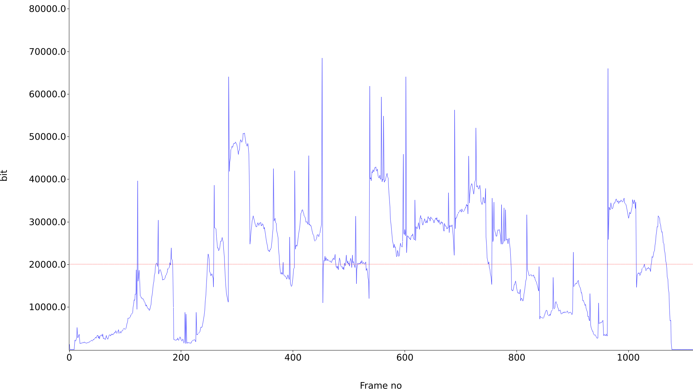

# vbitrate-viewer [](https://github.com/takehirokj/vbitrate-viewer/actions)

Showing a graph of a Video bitrate on each frames.



## Building
### Dependency
FFmpeg-libav* library is used to get a bitrate of each frames and some font library for plotting.
```sh
sudo apt install libavcodec-dev libavformat-dev libavfilter-dev libavutil-dev libfontconfig1-dev
```

### Release binary
To build release binary in `target/release/vbitrate-viewer`, run:

```sh
cargo build --release
```

## Usage
```sh
cargo run --release -- -i input.mp4 -o output.png
```

## Contributing
### Coding style
Format code with rustfmt before submitting a PR.
```sh
cargo fmt
```

## Code Analysis
Use [clippy](https://github.com/rust-lang/rust-clippy) before submitting a PR.
```sh
cargo clippy
```

## Testing
Run unit test.
```sh
cargo test
```

